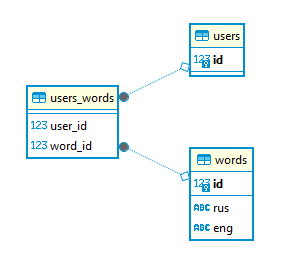

# ТГ-чат-бот «Обучалка английскому языку»
Функции бота:
- Запрашивает перевод слова, предлагая 4 варианта ответа на английском языке в виде кнопок.
- Исходная база данных на данный момент состоих из 10 тестовых слов.
- Слово выбирается из базы слов пользователя случайным образом.
- При правильном ответе подтверждает ответ, при неправильном можно попробовать снова или перейти к следующему слову.
- Реализована функция добавления нового слова.
- Реализована функция удаления слова. Слово при этом удаляется персонально для пользователя, не затрагивая других.
- Новые слова доступны только пользователю, которых их добавил.
## Для запуска бота необходимо выполнить следующие действия:
- Переименовать файл config.ini.example в config.ini.example
- В файле указать "dsn" в формате: postgresql://<имя пользователя>:<пароль>@<хост>:<порт>/<имя базы>
- Указать "token" - токен вашего телеграм бота, созданного с помощью [BotFather](https://t.me/BotFather)
- Запустить файл db_main.py для создания таблиц в базе данных и заполнения слов.
- Запустить бота (файл bot.py)
## Схема базы данных

Функции записи и чтения данных из базы находятся в файле db_models.py
